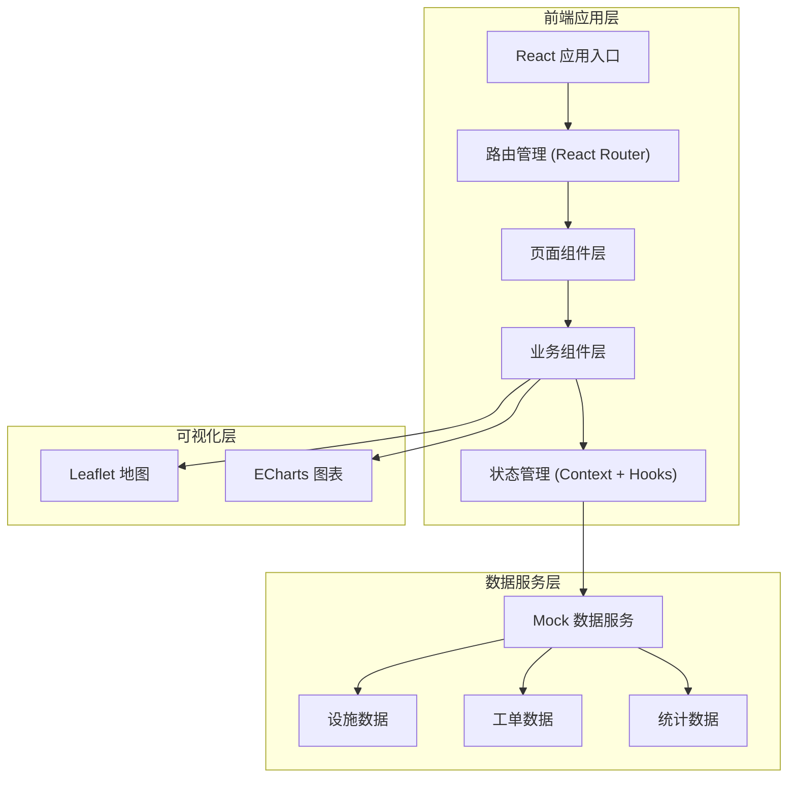

# 城市公共烟蒂收集点与吸烟区地图系统 - 技术架构文档

## 1. 架构设计

本项目为纯前端单页应用，使用 Mock 数据模拟后端服务，便于本地运行与演示。



## 2. 技术描述

- **前端框架**：React@18 + TypeScript
- **构建工具**：Vite@5
- **样式方案**：TailwindCSS@3
- **地图组件**：Leaflet@1.9 + react-leaflet
- **图表组件**：ECharts@5 + echarts-for-react
- **路由管理**：React Router@6
- **图标库**：Lucide React
- **数据模拟**：本地 Mock 数据 + 工具函数
- **状态管理**：React Context + useReducer

## 3. 路由定义

| 路由路径 | 页面名称 | 说明 |
|---------|----------|------|
| / | 首页地图 | 地图主界面，设施点位展示与筛选 |
| /report | 问题上报 | 市民问题上报表单 |
| /workorders | 工单列表 | 工单追踪与管理 |
| /dashboard | 数据看板 | 统计分析与数据可视化 |
| /cleaner | 保洁员视图 | 保洁员工单管理界面 |
| /admin | 管理员视图 | 管理员监控总览 |

## 4. 数据模型

### 4.1 设施数据模型

```typescript
interface Facility {
  id: string;
  code: string;
  name: string;
  type: 'indoor_room' | 'outdoor_pavilion' | 'standalone_pillar';
  status: 'empty' | 'half' | 'nearly_full' | 'full';
  healthLevel: 'good' | 'warning' | 'alert' | 'danger';
  lat: number;
  lng: number;
  address: string;
  district: string;
  capacity: number;
  currentLevel: number;
  lastCleanTime: string;
  crowdDensity: 'low' | 'medium' | 'high' | 'very_high';
  hasAshtray: boolean;
  hasTrashBin: boolean;
  maintenanceDate: string;
}
```

### 4.2 工单数据模型

```typescript
interface WorkOrder {
  id: string;
  orderNo: string;
  facilityId: string;
  facilityName: string;
  type: 'overflow' | 'damage' | 'missing_bag' | 'other';
  description: string;
  images: string[];
  reporterName: string;
  reporterPhone: string;
  status: 'pending' | 'assigned' | 'processing' | 'completed' | 'cancelled';
  priority: 'low' | 'medium' | 'high' | 'urgent';
  createTime: string;
  assignTime?: string;
  processTime?: string;
  completeTime?: string;
  cleanerId?: string;
  cleanerName?: string;
  remark?: string;
}
```

### 4.3 用户角色模型

```typescript
type UserRole = 'citizen' | 'cleaner' | 'admin';

interface User {
  id: string;
  name: string;
  role: UserRole;
  avatar?: string;
  phone?: string;
  district?: string;
}
```

### 4.4 统计数据模型

```typescript
interface DashboardStats {
  totalFacilities: number;
  overflowRate: number;
  avgResponseTime: number;
  todayReports: number;
  districtDistribution: { name: string; value: number }[];
  overflowTrend: { date: string; rate: number }[];
  responseTimeTrend: { date: string; time: number }[];
  heatmapData: { lat: number; lng: number; value: number }[];
  facilityTypeDistribution: { name: string; value: number }[];
  statusDistribution: { name: string; value: number; color: string }[];
}
```

## 5. 项目结构

```
src/
├── assets/             # 静态资源
│   └── icons/          # 自定义图标
├── components/         # 公共组件
│   ├── Layout/         # 布局组件
│   ├── Map/            # 地图相关组件
│   ├── Charts/         # 图表组件
│   ├── Filters/        # 筛选组件
│   ├── Cards/          # 卡片组件
│   └── Common/         # 通用组件
├── pages/              # 页面组件
│   ├── Home/           # 首页地图
│   ├── Report/         # 问题上报
│   ├── WorkOrders/     # 工单列表
│   ├── Dashboard/      # 数据看板
│   ├── CleanerView/    # 保洁员视图
│   └── AdminView/      # 管理员视图
├── context/            # 全局状态
│   ├── AppContext.tsx
│   └── MapContext.tsx
├── data/               # Mock 数据
│   ├── facilities.ts
│   ├── workorders.ts
│   └── statistics.ts
├── hooks/              # 自定义 Hooks
│   ├── useMap.ts
│   ├── useFilter.ts
│   └── useWorkOrder.ts
├── types/              # TypeScript 类型定义
│   ├── index.ts
│   ├── facility.ts
│   └── workorder.ts
├── utils/              # 工具函数
│   ├── map.ts
│   ├── format.ts
│   └── mock.ts
├── App.tsx
├── main.tsx
└── index.css
```

## 6. 核心技术方案

### 6.1 地图方案

- 使用 Leaflet 作为地图基础库
- 采用 OpenStreetMap 或自定义烟灰色瓦片底图
- 自定义 DivIcon 实现多类型点位标记
- 支持点位聚合与散点展示切换

### 6.2 数据可视化

- 使用 ECharts 实现各类统计图表
- 柱状图展示区域设施分布
- 折线图展示趋势变化
- 饼图展示类型占比
- 热力图展示上报密度

### 6.3 状态管理

- 使用 React Context 管理全局状态（用户角色、筛选条件等）
- 使用 useState/useReducer 管理组件级状态
- 自定义 Hooks 封装复用逻辑

### 6.4 响应式实现

- 使用 TailwindCSS 响应式工具类
- 桌面端：三栏布局（侧边栏 + 主内容 + 详情面板）
- 平板端：两栏布局 + 可折叠侧边栏
- 移动端：单栏 + 底部导航 + 抽屉式面板
